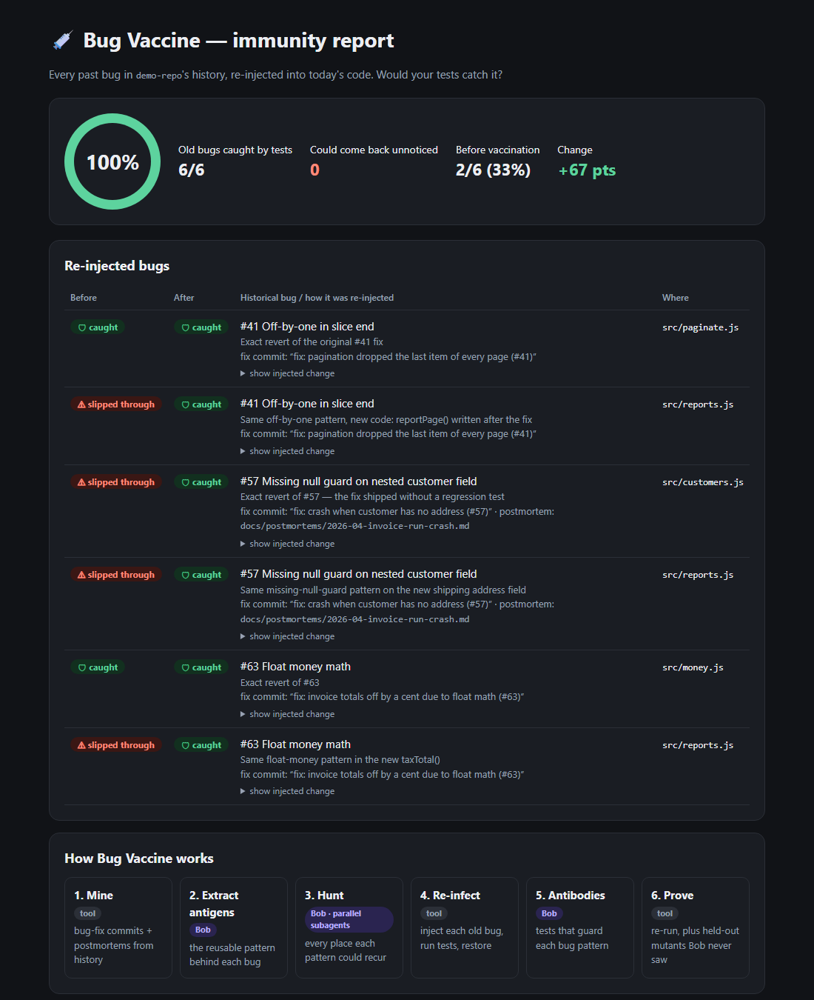

<p align="center">
  <picture>
    <source media="(prefers-color-scheme: dark)" srcset="assets/logo/bug-vaccine-logo-dark.svg">
    
  </picture>
</p>

# Bug Vaccine

**▶ [Watch the demo video](https://youtu.be/gV39HRti6cA)** · **🌐 [Try the live dashboard](https://bug-vaccine.vercel.app)**

> **Every codebase remembers its own mistakes. Bug Vaccine makes sure it never repeats them.**

An IBM Bob 2.0 Hackathon project (lablab.ai). IBM Bob 2.0 runs the AI steps; deterministic scripts do the measuring.



---

**The core in one sentence:** re-inject the bugs your team has already fixed, and prove whether your tests would catch them coming back. Everything else (the Debug lab, RAG and the Company view) reuses that same knowledge.

## The problem

Teams fix a bug, close the ticket, and move on. But:
- many fixes ship **without a regression test**, so the same bug can quietly return;
- the same *kind* of mistake gets written again in **new code** by someone who never saw the original incident;
- code coverage says "80% covered" but can't tell you whether **your known failure modes** would be caught.

## The solution

Bug Vaccine turns a repo's git history and incident postmortems into a vaccine:

| # | Step | Who | What happens |
|---|---|---|---|
| 1 | Mine | tool: [`mine.py`](vaccine/mine.py) | Collects bug-fix commits (full messages, `resolves #n`, reverts) and postmortem docs |
| 2 | Extract antigens | **Bob**: document understanding | Names the reusable *pattern* behind each bug and flags postmortem follow-ups that were never done |
| 3 | Hunt | **Bob**: parallel subagents | One subagent per pattern finds every place it could recur, including code written *after* the fix |
| 4 | Re-infect | tool: [`run.py`](vaccine/run.py) | Injects each old bug one at a time and runs the tests. Caught = immune |
| 5 | Antibodies | **Bob**: Agent mode | Writes tests that guard each *pattern*; iterates until all are caught |
| 6 | Prove | tool | Re-runs; before/after report |
| 7 | Held-out check | **Bob**: fresh subagent | New variants the antibody writer never saw, to prove the tests aren't overfitted |
| 8 | PR mode | **Bob** + tool | Checks only a PR's changed files and posts a comment if new code repeats a past bug |

**Bob proposes; the test runner decides.** Every number in the report comes from actually running the test suite.

## Measured on the demo repo

| | Result |
|---|---|
| Past bugs caught if re-introduced | **2/6 (33%) → 6/6 (100%)** |
| Held-out mutants caught | **6/6 (100%)**, see the caveat in [problem & solution](docs/problem-and-solution.md) |
| PR #88 (`refunds.js` + `loyalty.js`) | **5 risks flagged before merge**: 3 new lines repeating known bugs, 2 untested past-bug sites |
| Cure | **3 of 3 repeated bugs patched** with the company's own fixes; tests pass; re-scan clean |
| Prevent | pre-commit guard **blocks** a new copy of bug #41; 3 Semgrep rules exported |
| Production code changed | none; only tests added |
| One re-check (baseline + 6 mutants) | ~4.5 s with `node --test` |

Findings a reviewer would likely miss:
- **#57 was fixed without a test.** Its postmortem said to add one, and it never happened.
- The newer `reports.js` repeats **all three** historical bug patterns, and its tests catch none of them.

## Cure and prevent

Finding a repeated bug is only half the job. Bug Vaccine also **fixes it with the fix your team already wrote**, and **stops it coming back**:

| | Command | What it does |
|---|---|---|
| **Cure** | `bugvaccine.py patch <repo> --base main --apply` | Applies each bug pattern's *fix recipe* (learned from the original fix commit), only on lines where that bug's signature matches. Re-runs your tests and **rolls everything back if they fail**, then re-scans to prove the bug is gone. Without `--apply` it's a dry run that shows the diff. Lines with no recipe are handed to Bob. |
| **Prevent: commits** | `bugvaccine.py guard install <repo>` | A pre-commit hook that **blocks commits** whose new lines repeat a known company bug, and shows the historical fix. `patch . --staged --apply` fixes them in one step. |
| **Prevent: PRs** | `bugvaccine.py pr ...` | The PR comment shows a **suggested fix** for each repeated bug; `--fail-on-new-risks` makes CI block the merge. |
| **Prevent: everywhere** | `bugvaccine.py rules <repo>` | Exports the knowledge as **Semgrep rules**, so IDEs and other CI tools flag the patterns too. |
| **Prevent: tests** | Bob, Phase 3 | Antibody tests guard each pattern in the test suite itself. |

In the demo, PR #88 repeats three known bugs: all three are patched with the company's own fixes, the tests pass, the re-scan is clean, and the guard then blocks a fresh copy of bug #41 at commit time.

## Real-world case study: tomli

We ran it on [tomli](case-studies/tomli/), the TOML parser that became Python's built-in `tomllib`:
- One bug pattern (an internal error leaking instead of `TOMLDecodeError`) had been **fixed three separate times** in three places.
- All **16/16** re-injected historical bugs were caught. tomli is very well tested, and Bug Vaccine didn't cry wolf.
- A control mutant exposed **one real test gap** (the Unicode upper bound). The antibody for it is in the case study, ready to contribute upstream.

## Use it on your own repo

```bash
python bugvaccine.py init path/to/your-repo --test "npm test --silent" --name billing-api   # checks your tests pass first
python bugvaccine.py mine path/to/your-repo
# Bob: paste your-repo/.bugvaccine/PROMPT.md   (antigens, mutants, antibodies)
python bugvaccine.py check path/to/your-repo    # validate mutants, no tests run
python bugvaccine.py run   path/to/your-repo --html
python bugvaccine.py pr    path/to/your-repo --base main
```

Full guide, including test commands for each stack, cost and limitations: **[docs/USING-ON-YOUR-REPO.md](docs/USING-ON-YOUR-REPO.md)**. For CI, use [the GitHub Actions workflow](integrations/github-actions/bug-vaccine.yml): a PR comment plus a `min_immunity` gate.

## See it work (demo, ~15 seconds)

```bash
python bugvaccine.py demo
start prototype-output/dashboard.html      # macOS: open, Linux: xdg-open
```

The **dashboard** is an interactive, offline, single-file view of a whole run. It has an assay-plate view (one well per re-injected bug, green if caught, red if it slipped through), a step-by-step pipeline, mutant details with diffs, and a GitHub-style PR comment preview. **Play walkthrough** steps through the story automatically, which is useful for demos and videos. For your own repo: `python bugvaccine.py dashboard <repo>`.

The dashboard has three views:

| View | What it's for |
|---|---|
| **Vaccine run** | The 8-step story of one run, with the assay plate, mutant diffs and PR preview. **Captions** show a narration line per step, and **Play walkthrough** steps through it on its own, for presenting or recording. |
| **Debug lab** | Paste an error, stack trace, customer report, code or a **pull request diff** (or drop a file) and check it against every bug the company has already fixed. |
| **Company** | Every project's immunity side by side, bugs that were **fixed more than once**, and an impact estimate where you set the assumptions (hours, cost, likelihood) and the bug counts come from measurements. |

The **Debug lab** turns the same knowledge into a debugger. Paste an error, stack trace, customer report or new code, and it tells you whether your company has had this bug before: the matching line, how it was fixed, the test to add, and the past incident. Anything new goes to Bob with a ready-made prompt. You teach it by vaccinating more repos (`bugvaccine.py learn`), or by adding a pattern straight from the page. See [the guide](docs/USING-ON-YOUR-REPO.md#debugging-with-company-knowledge-the-debug-lab).

It walks through all 8 steps, pausing between each, and writes reports to `prototype-output/`. Add `--no-pause` to run it straight through.

> **Prototype note:** the **[BOB]** steps use pre-written stand-in outputs (`prototype/bob-standin/`, `examples/`) so the flow can be seen without Bob access. In the submission run, Bob produces them live from [`bob-prompts/`](bob-prompts/).

**Submission docs:** [challenge alignment](docs/challenge-alignment.md) · [problem & solution](docs/problem-and-solution.md) · [how Bob was used](docs/how-bob-was-used.md) · [demo video script](docs/demo-video-script.md)

## Real run with Bob

```bash
python demo/build_demo_repo.py                     # demo-repo/ with real git history + postmortem
python vaccine/mine.py demo-repo -o antigens-raw.md
# Bob: bob-prompts/01 → 02                         (antigens.json, mutants.json)
python vaccine/run.py mutants.json --repo demo-repo -o results-before.json --html report-before.html
# Bob: bob-prompts/03 → 04 → 05                    (antibodies, held-out check, PR mode)
```

`run.py` works on any repo and test runner: `--test "pytest -q"`, `--test "npm test"`, etc. The test command runs through the shell, so only pass commands you trust.

## Tests

```bash
python -m unittest discover tests
```

Unit and end-to-end tests cover mutant injection (CRLF and legacy-encoded files), the CI gate, fix-commit detection, the debugger and RAG, every security protection, and the problems found in a full "company" dry run (see `tests/test_company_run.py`). CI runs them on Windows, macOS and Linux with Python 3.9 to 3.13 (`.github/workflows/tests.yml`).

Requires Python 3.9+, git, and Node.js 20+ for the JavaScript demo. No pip installs.

**Getting the tool:** clone your team's copy of this repository (or download it as a ZIP) next to your repos. On Windows, keep paths short or enable long paths; see the guide's Troubleshooting section.

## How it's different

Classic mutation testing (Stryker, PIT) flips random operators, which produces thousands of mutants, mostly noise. Research has also learned mutants from bug-fix history (e.g. Tufano et al., ICSME 2019). Bug Vaccine is a **per-repo, agent-run workflow**: it turns *your own* incidents and postmortems into a handful of high-value mutants, proves the resulting tests generalise with a held-out check, and runs in code review.

## RAG: ask your company's bug history

`bugvaccine.py index` builds a corpus from fix commits, postmortems, learned bug patterns and your docs. `bugvaccine.py ask` retrieves the most relevant pieces (BM25 plus signature-boosted hybrid ranking) and writes a **grounded prompt with numbered sources** that Bob must cite. The Debug lab shows the same retrieved sources next to every result. It runs fully locally, with no embeddings API and no code leaving the machine.

## Security

Bug Vaccine runs tests, rewrites files and handles company code, so it's built defensively:
- mutants can't touch files outside the repo;
- CI can't be hijacked by a PR that edits the config;
- secrets are redacted from everything the tool outputs;
- the dashboard has a strict Content-Security-Policy with no network access;
- dangerous regexes are rejected.

See **[SECURITY.md](SECURITY.md)** for the threat model. Every protection has a test.

Never commit IBM Cloud API keys or any secret. `.env` files are git-ignored.

## License

[MIT](LICENSE)

## Built on the IBM Hackathon template

This repo was created from the [IBM Hackathon GitHub template](https://github.com/watsonxhackathon/ibm-hackathon-template), which adds safeguards against committing credentials:

- **`.gitignore`**: blocks `.env` files, keys and live Bob session files
- **`.bobignore`**: keeps credentials out of what IBM Bob reads and logs
- **`.env.example`**: the only place credential *names* appear; real values stay in a local `.env`
- **`bob_sessions/`**: every team member's IBM Bob task-session summary screenshots

Before every commit: review `git diff`, keep keys in environment variables, and run `python tools/leak_scan.py` (it must print `clean`). Full guidelines: [SECURITY.md](SECURITY.md).
