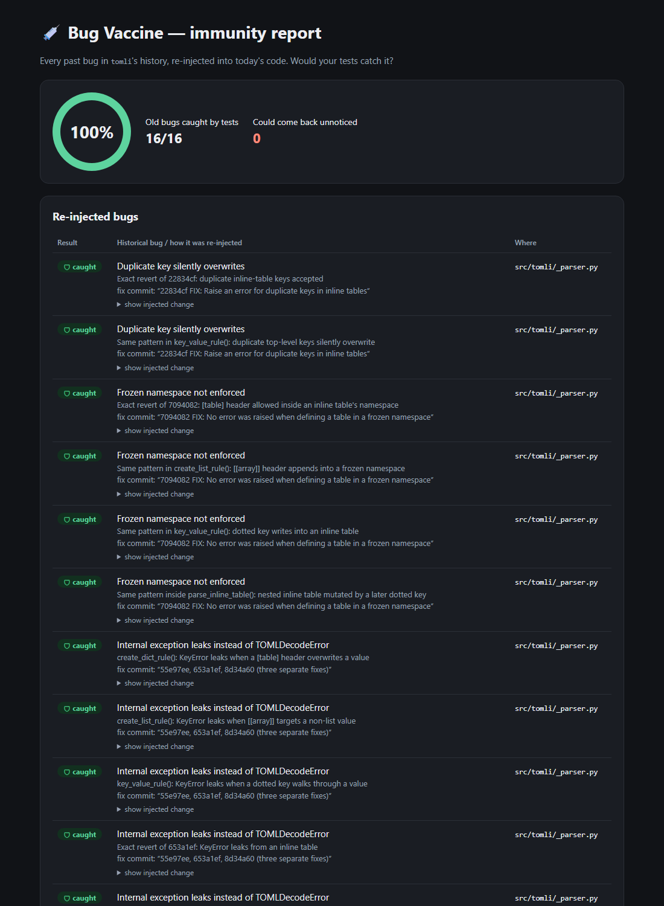

# Case study: tomli (real open-source project)

[tomli](https://github.com/hukkin/tomli) is the TOML parser that became Python's standard-library `tomllib`. We ran Bug Vaccine on it at commit `5a77b12` (2026-04-14) to see how it behaves on real code with real history.



> **Who did the AI steps:** antigens, mutants and the antibody were written by Claude, acting as a stand-in for IBM Bob, from tomli's real commit history. Every result below was measured by `vaccine/run.py` against tomli's own test suite.

## Reproduce

```bash
git clone https://github.com/hukkin/tomli && git -C tomli checkout 5a77b12
python vaccine/run.py case-studies/tomli/mutants.json --repo tomli --test "set PYTHONPATH=src&& python -m unittest -q"
# macOS/Linux: --test "PYTHONPATH=src python -m unittest -q"
```

## 1. Mining: real history is noisy

`mine.py` flagged **25** candidate fix commits. About half were genuine behaviour bugs. The rest were CI, typing, benchmarks or badges ("Fix mypy errors", "Fix GitHub Actions badge", "pre-commit autoupdate"). This is why Phase 1 asks the agent to **discard** non-bugs. The miner is deliberately broad; the agent is the filter.

## 2. Antigens: several fixes, one pattern

| Antigen | Pattern | From fix commits |
|---|---|---|
| T1 | Duplicate key silently overwrites | 22834cf |
| T2 | Frozen (inline) namespace not enforced | 7094082 |
| **T3** | **Internal `KeyError`/`ValueError` leaks instead of `TOMLDecodeError`** | **55e97ee, 653a1ef, 8d34a60** |
| T4 | Invalid Unicode escape accepted | 91df038 (#27) |
| T5 | Dotted-key namespace flags not finalised | 9e56735 (#125) |
| T6 | Unbounded key depth | e1fdb94 (#286) |

**T3 was fixed three separate times, in three different places.** That's the recurring-pattern problem Bug Vaccine exists for.

The code had been heavily refactored since some fixes, so a literal revert wasn't possible. The mutants re-introduce the *pattern* at today's code sites: 16 mutants across `create_dict_rule`, `create_list_rule`, `key_value_rule`, `parse_inline_table`, the date parser and the Unicode escape parser.

## 3. Result: 16/16 caught

| | Result |
|---|---|
| Historical mutants caught | **16 / 16 (100%)** |
| Test-suite run time | ~0.3 s per mutant |

We verified the kills are genuine by checking *which* tests fail. Each mutant is caught by a test aimed at that exact bug, e.g. `[feb-29]` and `[invalid-day]` for the date fix, `[non-scalar-escaped]` for the Unicode fix, and `test_key_recursion_limit` for #286. tomli uses the shared [toml-test](https://github.com/toml-lang/toml-test) suite of invalid documents, which is why its immunity is so high.

**Takeaway:** on a well-tested project, Bug Vaccine confirms the protection is real and doesn't cry wolf.

## 4. Controls: can it detect a survivor here?

To rule out a false 100% (e.g. every mutant breaking the import), we added control mutants:

| Control | Change | Result | Meaning |
|---|---|---|---|
| C1 | Error message wording only | survived | Expected: harmless (an *equivalent* mutant). Proves the runner reports survivors on this repo. |
| C2 | Key-depth limit made 100x looser | caught | `test_key_recursion_limit` pins it |
| **C3** | **Unicode upper bound off by one** (`1114111` → `1114112`) | **survived** | **A real test gap** |

## 5. The real gap: C3

With C3 applied, `tomli.loads('a = "\U00110000"')` raises a raw **`ValueError`** instead of `TOMLDecodeError`, the **T3 pattern arriving by a new route**. No test pins the exact upper boundary of the Unicode scalar range, so the suite stays green.

**Antibody:** [`test_antibody_unicode_bounds.py`](test_antibody_unicode_bounds.py) tests both sides of every boundary (`0xD7FF`/`0xD800`, `0xDFFF`/`0xE000`, `0x10FFFF`/`0x110000`) and requires `TOMLDecodeError` for invalid ones. With it added: C3 is caught, and all 16 historical mutants are still caught.

This is a small, real improvement that could be offered upstream to tomli.

## Files

| File | What |
|---|---|
| `mutants.json` | 6 antigens, 16 mutants |
| `controls.json` | 3 control mutants |
| `results-before.json` | 16/16 run |
| `results-controls.json`, `results-controls-after.json` | controls before / after the antibody |
| `test_antibody_unicode_bounds.py` | the antibody, ready to copy into tomli's `tests/` |
